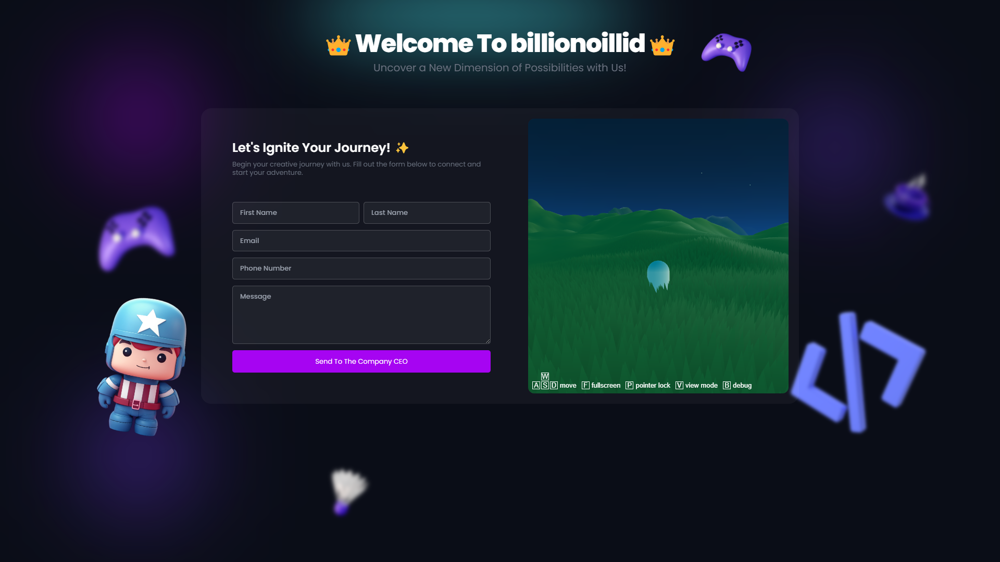

# 🚀 **Welcome to _Project Billionoid_!** 🌌



> "Reach out and let's create a universe of possibilities together!" ✨

---

### 💡 **Project Overview**

**_Project Billionoid_** is a visionary platform where creativity meets technology, and possibilities become endless. Together, we'll connect constellations of ideas and innovation!

---

## 🔧 **Features**

- 🌟 **Collaborate effortlessly:** Join a galaxy of minds to share and grow ideas.
- 💬 **Interactive communication:** Reach out to the CEO in seconds with our lightning-fast form.
- 💻 **Tech Stack:** Powered by **React**, **Tailwind CSS**, **Node.js**, and **MongoDB**.
- 🌍 **Real-time interactions:** Instant feedback and submission.

---

## 🛠️ **How to Run the Project**

1. Clone the repository:
    ```bash
    git clone https://github.com/Yuslash/project-billionoid.git
    ```

2. Install dependencies:
    ```bash
    npm install
    ```

3. Set up your environment variables for MongoDB:
    ```bash
    MONGO_URI=your_mongodb_connection_string
    ```

4. Start the project:
    ```bash
    npm run dev
    ```

5. Deploy the backend with **Zoho Catalyst** following the [Zoho Catalyst Documentation](https://catalyst.zoho.com/) 🚀

---

## 💻 **Tech Stack**

| Frontend      | Backend      | Database  | Deployment      |
|---------------|--------------|-----------|-----------------|
| React         | Node.js      | MongoDB   | Zoho Catalyst   |
| Tailwind CSS  | Express      |           |                 |

---

## 🤝 **Contributing**

We welcome **collaborators** to our cosmic journey! Feel free to submit a pull request or report issues. 

1. Fork the repo 🍴
2. Create a new branch (`feature/my-awesome-feature`) 🌿
3. Commit your changes (`git commit -m 'Added my awesome feature'`) ✨
4. Push to the branch (`git push origin feature/my-awesome-feature`) 🚀
5. Open a Pull Request 👾

---

## 🌠 **License**

This project is licensed under the MIT License. See the `LICENSE` file for details.

---

## 📫 **Contact**

- **CEO & Founder:** Yuslash 🌟

---

### Made with 💖 by [Yuslash](https://github.com/Yuslash)
